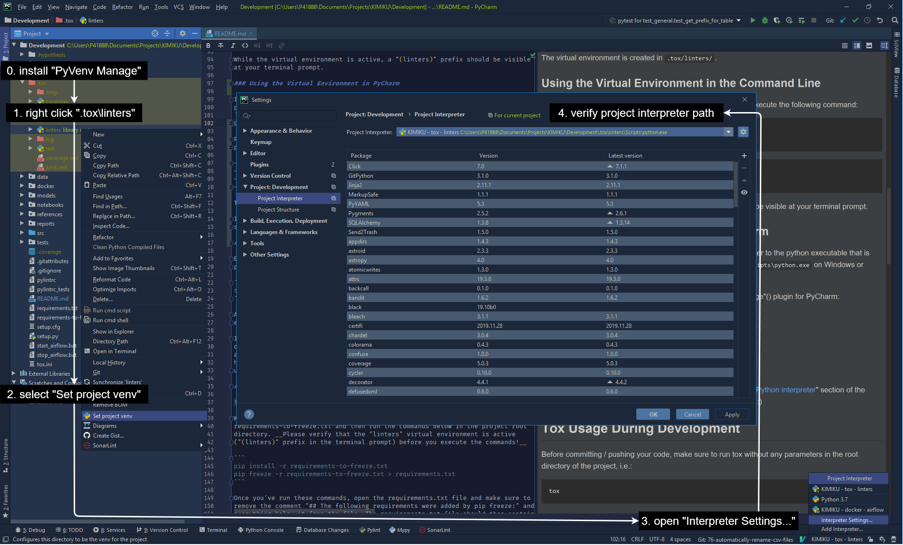
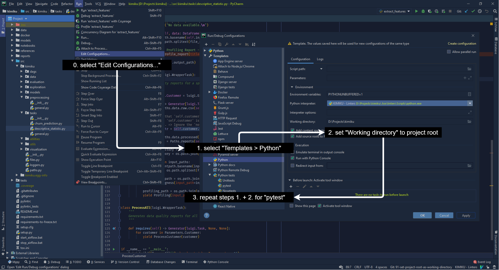
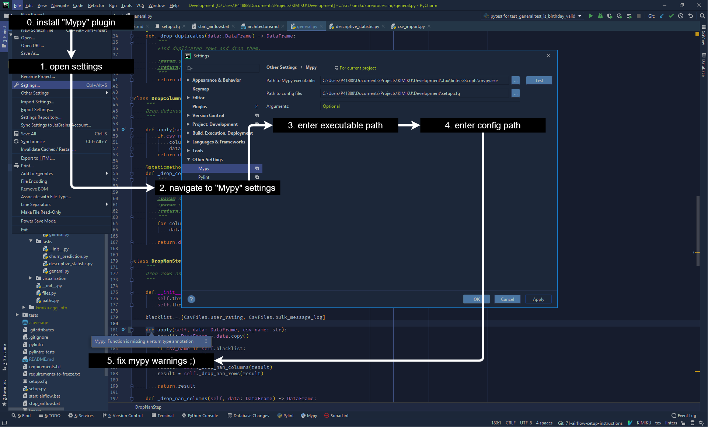
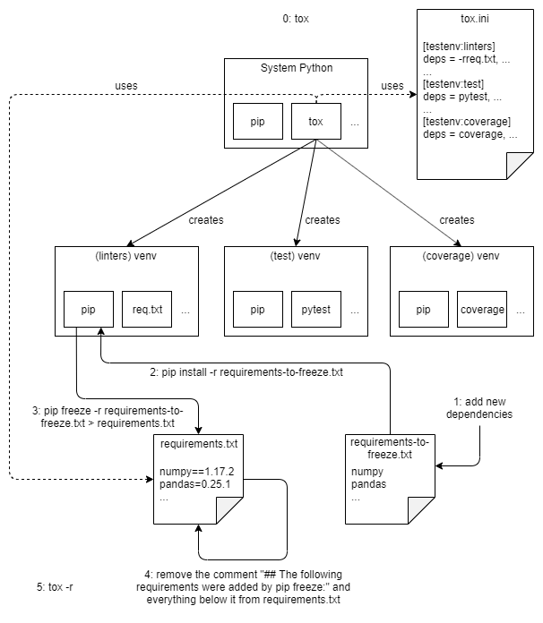

# Getting started

## Project Dependencies

To run the project, you need to have the following dependencies installed:

- [Python 3.7 64bit](https://www.python.org/downloads/release/python-370/)
- [pip](https://pip.pypa.io/en/stable/installing/) (automatically installed with Python)
- [tox](https://tox.readthedocs.io/en/latest/install.html)

## Initial Tox Setup

After you've cloned the project and installed all the required dependencies,
you should verify that everything is working as expected. To do this, open a
terminal window in the root directory of the project and run the following
command:

```
tox
```

What happens in response to this is configured in the `tox.ini` file. In our
case, tox first creates a new virtual environment (`.tox/env`) and installs
packages for linting, (unit) testing and code coverage reporting into it. Tox
then uses the installed packages to lint the source code (using mypy [[2]],
flake8 [[3]], pylint [[4]] and bandit [[5]]; plus black [[6]] to format the
code before linting), run our unit tests and create test coverage reports from
the the unit test results.

Beware that the first run of tox might take a few minutes, because tox has to
install all the necessary packages inside of the virtual environment that it
creates. Subsequent runs will be much quicker.

At the end of tox's output, you should see a message like the following:

```
linters: commands succeeded
test: commands succeeded
coverage: commands succeeded
congratulations :)
```

If this is the case, you're good to go.

If no "congratulations :)" message appears, have a look at the console output (there should be some errors). 
Note that this doesn't necessarily mean that you've done something wrong, but might
just indicate that "broken" code made it into the master branch somehow.

When asking for help, and in case you're feeling feisty, you might also want to
ask whether the person who caused the mess-up should have to bring a cake for
it. The answer will probably be "no", but for a chance to get a cake, it's worth
a try, right?

## Virtual Environment Setup

To set up a virtual environment that comes pre-installed with all the project
dependencies, execute the following command in the root directory of the
project:

```
tox
```

The virtual environment is created in `.tox/env/`. To activate the virtual
environment in a command line window, execute the following command:
 
```
# Windows:
.tox\env\Scripts\activate.bat
```

```
# Linux / macOS:
source .tox/env/bin/activate
```

While the virtual environment is active, a "(env)" prefix should be visible
at your terminal prompt.

## PyCharm Setup

### Project Interpreter Setup

If you're using PyCharm, you should set the project interpreter to the
Python executable that is contained in the "env" virtual environment, i.e.
`.tox\env\Scripts\python.exe` on Windows or `.tox/env/bin/python3` on
Linux and macOS.

Perhaps the easiest way to do this is through the "PyVenv Manage" plugin for
PyCharm:

- install the [PyVenv Manage](https://plugins.jetbrains.com/plugin/10085-pyvenv-manage) plugin,
- restart PyCharm,
- right click on the folder `.tox\env`,
- select the "Set project venv" option in the context menu.

To verify that the project interpreter setup worked correctly, open the project
interpreter settings and check that the path to the project interpreter really
does point at `.tox\env\Scripts\python.exe` on Windows or `.tox/env/bin/python3`
on Linux and macOS.



If something doesn't seem right, please consult the "[Configure a Python interpreter](https://www.jetbrains.com/help/pycharm/configuring-python-interpreter.html)"
section of the PyCharm documentation or (even better) your favorite senior
project member. :)

### Working Directory Setup

To ensure that file paths used in scripts work correctly, all script executions
have to use the project root directory as their working directory.

In PyCharm, the default working directory can be set through the "Run/Debug
Configurations". The screenshot below shows how to access and change them as
needed for python and pytest scripts.




### Unit Testing Setup

We're using [pytest](https://docs.pytest.org/en/latest/) for unit testing. To
use pytest in PyCharm, you have to set it as the default test runner for the
project. Instructions for how to do this can be found in the [Pytest](https://www.jetbrains.com/help/pycharm/pytest.html#enable-pytest)
section of the PyCharm documentation.

### MyPy Setup

We're using [mypy](http://mypy-lang.org/) for static type checking. To see
mypy's warnings right inside of PyCharm:
 
- install the "[Mypy](https://plugins.jetbrains.com/plugin/11086-mypy)" plugin,
- restart PyCharm,
- open the plugin settings at "File > Settings > Other Settings > Mypy",
- set the "Path to Mypy executable" to `${PROJECT_DIR}\.tox\env\Scripts\mypy.exe`,
- set the "Path to config file" to `${PROJECT_DIR}\setup.cfg.`.

With that done, you should start seeing mypy warnings in your code.



## Tox Usage During Development

Before committing / pushing your code, make sure to run tox without any
parameters in the root directory of the project, i.e.:

```
tox
```

As described in the "Initial Tox Setup" section, this automatically creates
three virtual environments ("linters", "test" and "coverage") that lint the
code, execute tests and generate code coverage reports. Results of this are
shown in the command line window in which tox was executed. If everything is
fine as far as linters and tests are concerned, tox's output ends with the
following message:

```
linters: commands succeeded
test: commands succeeded
coverage: commands succeeded
congratulations :)
```

Code coverage should be at around 70-80% at least for the code that you've
touched with your changes. Higher coverage is fine as well, of course. :) To
find out what the current coverage rates are, you can either:

1.) look at tox's command line output, which shows coverage information the
following way:

```
Name                                                                      Stmts   Miss Branch BrPart  Cover   Missing
---------------------------------------------------------------------------------------------------------------------
.tox\test\Lib\site-packages\project\dags\csv_import.py                         5      5      0      0     0%   5-12
.tox\test\Lib\site-packages\project\dags\descriptive_statistics.py            62     62      8      0     0%   5-170
.tox\test\Lib\site-packages\project\dags\general_preprocessing.py             31     31      8      0     0%   5-88
.tox\test\Lib\site-packages\project\dags\helpers.py                            6      6      0      0     0%   5-20
.tox\test\Lib\site-packages\project\data\csv_import.py                        38     38     14      0     0%   5-145
.tox\test\Lib\site-packages\project\exploration\descriptive_statistic.py      24     24      2      0     0%   6-64
.tox\test\Lib\site-packages\project\loggers.py                                 6      6      0      0     0%   5-23
.tox\test\Lib\site-packages\project\paths.py                                 135     14      4      0    87%   68, 76, 220-224, 232, 241-245, 253, 279, 287
.tox\test\Lib\site-packages\project\preprocessing\general.py                 139      1     30      1    99%   48->49, 49
.tox\test\Lib\site-packages\project\tasks\churn_prediction.py                 58     58      2      0     0%   6-131
.tox\test\Lib\site-packages\project\tasks\descriptive_statistic.py            70     70      8      0     0%   6-131
.tox\test\Lib\site-packages\project\tasks\general.py                          53     53     12      0     0%   6-103
---------------------------------------------------------------------------------------------------------------------
TOTAL                                                                       658    368     88      1    43%
```

2.) look at the HTML coverage reports by opening the `.tox\htmlcov\index.html`
file. These are quite a bit nicer to look at than the command line output. ;)

Beware that files with 100% coverage are not included in the coverage reports,
so if you can't find a file in the list, it probably just means that it's at
100% coverage already. This, however, shouldn't discourage you from writing
additional tests that deal with (edge) cases that aren't covered by existing
tests. After all, 100% coverage does not guarantee bug free code.

If code coverage is too low or tox reported any other errors, it's your
responsibility to fix that. As usual, please don't hesitate to ask for help if
any of the error messages don't seem to make any sense to you or you're having
trouble reaching high enough coverage. Ignoring errors or low code coverage is
not an option and your reviewer will happily remind you of this fact when you
submit code for review that doesn't meet these quality standards.

### Installing New Python Packages



When you want to install new packages, you have to __manually__ add them to the
requirements-to-freeze.txt and then run the commands below in the project root
directory. __Please verify that the "env" virtual environment is active
("(env)" prefix in the terminal prompt) before you execute the commands!__

```
pip install -r requirements-to-freeze.txt
pip freeze -r requirements-to-freeze.txt > requirements.txt
```

Once you've run these commands, open the requirements.txt file and make sure to
remove the comment "## The following requirements were added by pip freeze:" and
everything below it from the file. The requirements.txt file should then contain
the same dependencies as the requirements-to-freeze.txt file, but with pinned
versions.

**Don't install packages through PyCharm, even if it offers to do so.**
PyCharm's automatic package installs simply aren't compatible with our pip
workflow, which we adopted from "A Better Pip Workflow" [[Reitz, 2016]].

To be safe, you should recreate tox's virtual environments whenever the
requirements.txt file is changed. Beware that the requirements.txt file can
not only change when you install/freeze dependencies, but might also change
after git checkouts, rebases, etc.

To recreate the virtual environments, execute the following commands in the
root directory of the project:

```
tox -r
```

This ensures that the newest dependencies from the requirements.txt file are
installed in the virtual environments.